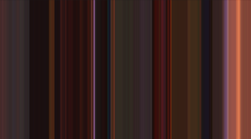
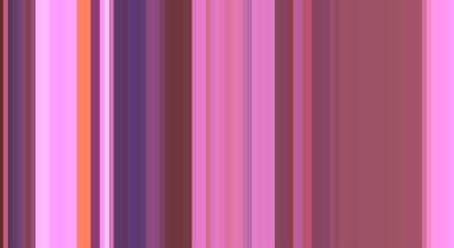

<b> Disclaimer:</b> I am publishing this written tutorial almost two years after I had completed the project. So there may be some incomplete code, and missing references for code borrowed. The execution is my own, though I may have borrowed small code tidbits from other sources. 

This idea was inspired by Tumblr user MovieBarcode ([moviebarcode](https://moviebarcode.tumblr.com/)). I decided to create my own version of this art using my Arduino set, photoresistors, and p5.js library. 

## Quick Description

I created a python program that produces generative art when a video clip is displayed on screen in front of three photoresistors that are connected to an Arduino Uno microcontroller. The program reads the photoresistor’s RGB values from the Arduino serial monitor and combines them into one color value. I used the p5.js python library to append a stripe of that color every 0.3 seconds onto a canvas, creating an image of vertically-arranged differently coloured stripes, unique to the clip being played. 

The image on the left was produced from a clip from the movie “Shrek”, and the image on the right was produced from a clip of the tv show “Haikyu!!”.

<p>
 <div class="row">
      
    
</div> 
</p>


## Materials Used

- Arduino Uno 
- PhotoResistors
- Breadboard
- Basic resistors/wires/etc

## Helpful Links for Explorers
- [p5js.org](https://p5js.org/)

## Step By Step Playthrough

### Arduino Code
The circuit is very simple - it’s simply three phototransistors connected to analog input pins. The majority of this project is actually coding!

The first step is to create the code for the phototransistors to read the light values. We need to map the numbers they produce to values from 0-100 since we’ll be giving RBG values as percentages when it comes time to print the colours. 

The following Arduino code is quite straightforward:

```html
const int redPIN = A0;

const int greenPIN = A1;

const int bluePIN = A2;

int redVal, greenVal, blueVal;


void setup() {
  // put your setup code here, to run once:
  Serial.begin(9600);
}

void loop() {
  // put your main code here, to run repeatedly:
  redVal = analogRead(redPIN);
  greenVal = analogRead(greenPIN);
  blueVal = analogRead(bluePIN);


  redVal = map(redVal, 0, 50, 0, 100);

  greenVal = map(greenVal, 0, 50, 0, 100);

  blueVal = map(blueVal, 0, 50, 0, 100);

  Serial.print(redVal);
  Serial.print(" ");
  Serial.print(greenVal);
  Serial.print(" ");
  Serial.println(blueVal);
  delay(100);

}
```

The next step is all of the python code!

### The Ugly Code

Our first script will collect the data that the Arduino code prints on the serial monitor. Because the Arduino code prints the R G B values on one line, we will put each line into a list of its own with 3 entries (called temp_list)- one for each colour value. These small lists will be put into one large list, which I’ve named the rgb_list. The following site explains how to read the serial monitor through python: [Reading the Serial Monitor](https://problemsolvingwithpython.com/11-Python-and-External-Hardware/11.04-Reading-a-Sensor-with-Python/). 

The code below already follows these steps. 

 ```html
import serial
import time

ser = serial.Serial("/dev/cu.usbmodem14201", 9600)
time.sleep(2)

rgb_data = []

for i in range(500):
    b = ser.readline()
    string_n = b.decode()
    string = string_n.rstrip() # removes \n and \r
    # but doesn't remove spaces
    print(string)
    temp_list = string.split(" ")
    temp_list_2 = []
    for elem in temp_list:
        temp_elem = int(elem)
        temp_list_2.append(temp_elem)

    print(temp_list_2)
    rgb_data.append(temp_list_2)
    time.sleep(0.1)

print(rgb_data)

ser.close()

```
NOTE: Once you get your art up and loaded, you might see that your stripes are too dark. This happened to me because my computer did not generate enough light for the phototransistors to read values anywhere near 1023. Considering this, you might want to tailor your values; i.e., find the maximum value of light that the phototransistors will detect, then in the map() function, instead of listing 1023 as the high for the value you are scaling from, list the maximum value instead. This way, there will be a better range of brightness in your art.

<b>Some important notes regarding this website:  </b>
1. You may need to install Pyserial first: [PySerial](https://problemsolvingwithpython.com/11-Python-and-External-Hardware/11.01-PySerial/)
    * I recommend doing this through the terminal and not through VS code itself. Simple type “python”  in the command line, hit enter, and then follow the commands in the site.
2. The name of your Arduino port may not be in the format that they have specified. For example, my port is /dev/cu.usbmodem14201, as you’ll see in the code.

After you have completed these steps, it’s time to get our hands dirty! The way we’re going to display the colour of each frame is by printing a very thin rectangle with the combined RGB colour onto the screen. To accomplish this, we’ll use Pyp5JS, which is a fairly good program for beginners. To start, follow the instructions in the given site to install the needed packages: [Installing Pyp5js](https://berinhard.github.io/pyp5js/). 


Note: To avoid confusion, simply follow the steps from the “Installation” section and the “QuickStart” section. After completing the instructions in the “QuickStart” section, you’ll get a specific address, simply copy and paste that into your browser and you’ll be on the site where all of our artwork will be printed!

The basic functions we need to know to print our coloured rectangles are:
 ```html
	createCanvas(800, 800)
	background(100)
  colorMode(RGB, 100)
  stroke(172, 144, 135)
  fill(172, 144, 135)
  rect(0, 0, 1, 800)
 ```
In that order. 

<p>
<b>createCanvas()</b> specifies the width and height of the canvas we want to use. 800 by 800 is a pretty good size, but you can go smaller or bigger if you’d like.

<b>background()</b> specifies the colour of our canvas. If we only put one number, it gives us a colour on the greyscale, so putting 100 simply makes the canvas white.

<b>colourMode()</b> helps us specify the colour system we want to use, in this case RGB, and the 100 tells the program that we’ll be giving values between 0-100. 

<b>stroke()</b> is the function that specifies the outline colour of the rectangle. For our purposes, we’ll just make it match the main colour of the rectangle. We have to specify three values here, R, G, and B, all from 0-100. 

<b>fill()</b> fills the main shape of the rectangle with one colour. Once again we specify three values like in stroke(). 

<b>rect()</b> creates our rectangle and it’s shape. The first two numbers specify where on the canvas we want the top left corner of the rectangle to be located. The following two numbers give the width and height of the rectangle. 
</p>

We have to give the functions in that order for pyp5js to process it properly, although I’m not sure why.

The width and height of each individual rectangle will depend on how many times you want to sample the colour from the video you are playing. In order to avoid calculating this by hand, I’ve simply made a variable called rec_space that divides the length of our canvas by the length of our list once our script is done reading and sorting the values from the serial monitor. 

NOTE: The program will not work if you give a float value for the dimensions of the rectangles. Make sure to convert the rec_space variable into an integer like I have done. This will round the value down, and most likely you will not use the whole canvas space - but because it is white, we won’t even notice it. 

The final part of the python code is:

```html

rec_space = int(800/len(rgb_data))

rec_index = 0


with open('/Users/alvinagakhokidze/sketchbook-pyp5js/rrgb/rrgb.py','a+') as f:
    for elem in rgb_data:
        print(elem)
        f.write("stroke(" + str(elem[0]) + ", " + str(elem[1]) + ", " + str(elem[2]) + ")\n    ")
        f.write("fill(" + str(elem[0]) + ", " + str(elem[1]) + ", " + str(elem[2]) + ")\n    ")
        f.write("rect(" + str(rec_index) + ", 0, " + str(rec_space) + ", 800)\n    ")
        #f.write("rect(%d, 0, %f, 800)\n\t", rec_index, rec_space)
        rec_index += rec_space

# start = f.index("colorMode(RGB, 100)") + 18
```
This code opens an empty text file (that I created and put in the folder in advance), and writes the commands to it. 

Unfortunately, given that I am writing this too late, I do not remember the last step of how to sync this with p5.js. The "brute-force" way of doing it is to copy and paste the results of the overwritten text file into the p5.js interface and have it do it for you then. But if I recall correctly there is a way to automate it as well. 

Best of luck to whoever is interested in attempting a similar project, and I hope this (incomplete) tutorial can help!

