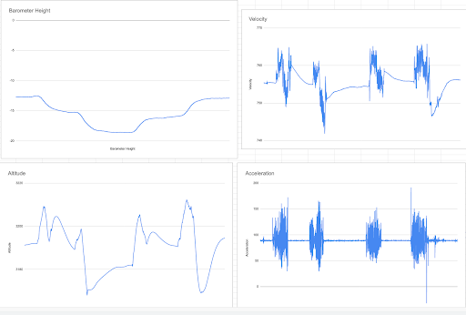
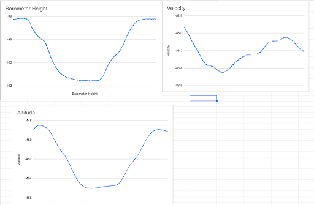

<b>Status:</b> Archived project for the UBC AeroDesign Team (Sensors and Controls Subteam)

## Quick Description
This project involved creating sensor fusion code for our design team'ss glider plane’s sensors. Our team wanted to use this code to be able to accurately read our plane’s roll, pitch, yaw, and altitude in order to know when to drop the payload. My tasks involved adapting existing open source code samples/projects from the LSM6DSM Inertial Measurement Unit (IMU) to the LSM6DS33 IMU in C++. I also conducted tests to determine if the adapted code predicted the position accurately, as I was modifying complex C++ code that I had little experience with.

## Materials Used

- Adafruit Feather nRF52840 
- Many, Many Websites

## Helpful Links for Explorers
- [How a Kalman Filter Works in Pictures](https://www.bzarg.com/p/how-a-kalman-filter-works-in-pictures/)
- [Juan Gallostra's Kalman Filter](https://github.com/juangallostra/AltitudeEstimation?utm_source=platformio&utm_medium=piohome)
- [LSM6DS33 Library](https://os.mbed.com/users/bclaus/code/LSM6DS33/file/4e7d663e26bd/LSM6DS33.h/)

## Step By Step Playthrough

I started this project by researching the Complementary Filter, and transitioned to reviewing the more complex, but more accurate, Kalman Filter. 

Finally, I found [Juan Gallostra's Kalman Filter](https://github.com/juangallostra/AltitudeEstimation?utm_source=platformio&utm_medium=piohome), I decided to adapt their code to the LSM6DS33 (the IMU on the Arduino Feather). This involved tons and tons of debugging. 

Throughout this debugging process, I would test the data that the IMU collected with the arduino serial plotter. The following images show data from walking up and down a flight of stairs:

Unfortunately, I kept running into an error, where if the board is left untouched, the data would go into sinusoidal behaviour:

Made some more changes, and noticed some improvements:

Unfortunately, a lot of problems were still being caused because Juan Gallostra's code is for the LSM6DSM, whereas the Arduino Feather Sense has the LSM6DS33.

I found this [LSM6DS33 Library](https://os.mbed.com/users/bclaus/code/LSM6DS33/file/4e7d663e26bd/LSM6DS33.h/), and used the functions in this library to replace the LSM6DSM ones to attempt to fix these issues.

At a certain point, the code would run properly, but there was always an offset to the velocity and other such values. But if fed the offset value, it would "work" (to be generous). 
